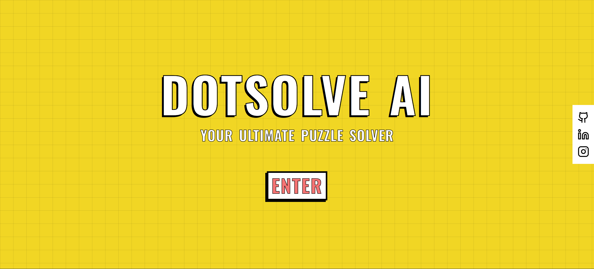
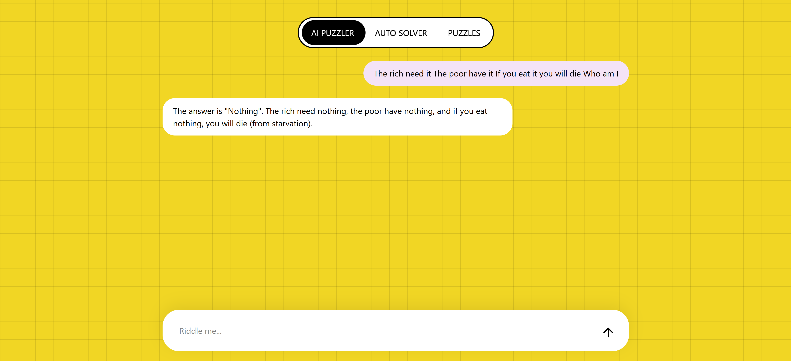
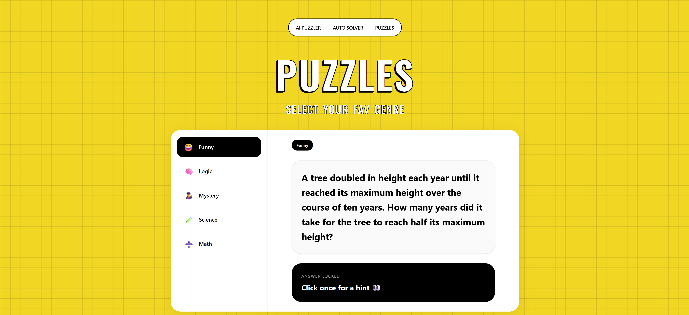
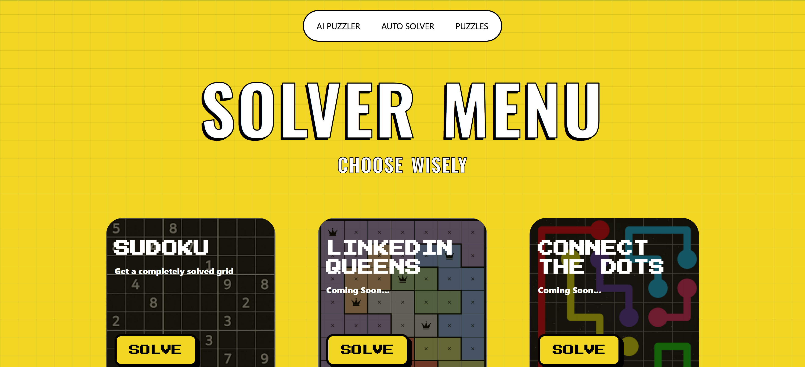

# DotSolve AI 🧩

> **Your Ultimate Puzzle Solver**  
> Solve riddles, mysteries, logic puzzles, brain teasers, and Sudoku challenges with AI.

---

## 🚀 Overview

DotSolve AI is a modern AI-powered puzzle platform built with **React**, **TypeScript**, **Vite**, and **Tailwind CSS**.

It combines:
- an intelligent AI puzzle assistant,
- automatic puzzle solving tools,
- and a curated collection of riddles and brain teasers

into one polished interactive experience.

Whether you want to challenge yourself with mysteries, solve a Sudoku instantly, or get step-by-step reasoning from AI, DotSolve AI delivers a fun and visually engaging experience across desktop and mobile devices.

---

# ✨ Features

## 🧠 AI Puzzler
An AI-powered puzzle assistant using **Groq + Llama 3.3 70B**.

- Solve riddles & logic puzzles
- Step-by-step explanations
- Puzzle-specialized AI behavior
- Context-aware conversation memory
- Smooth real-time chat interface
- Responsive animated UI

---

## 🎯 Puzzle Library
Explore categorized riddles and brain teasers.

### Categories
- 😂 Funny
- 🧠 Logic
- 🕵️ Mystery
- 🧪 Science
- ➗ Math

### Features
- Dynamic riddle generation via API
- Interactive answer reveal system
- Smooth transitions & loaders
- Clean split-panel puzzle interface

---

## ♟️ Auto Solver
Automatic puzzle solving tools.

### Current Support
- Sudoku Solver
- OCR-based image scanning using **Tesseract.js**
- Manual Sudoku grid input
- Instant solved puzzle generation

### Planned
- LinkedIn Queens Solver
- Connect The Dots Solver
- More puzzle types soon

---

# 🖼️ Preview

## Landing Page


---

## AI Puzzler


---

## Puzzle Library


---

## Auto Solver


---

# 🛠️ Tech Stack

## Frontend
- React
- TypeScript
- Vite
- Tailwind CSS
- Framer Motion

## AI
- Groq API
- Llama 3.3 70B

## OCR
- Tesseract.js

## Deployment
- Vercel / Netlify

---

# ⚙️ Installation

## 1. Clone Repository

```bash
git clone https://github.com/vinitpatil-8/dotsolve.git
```

---

## 2. Navigate Into Project

```bash
cd dotsolve/dotsolve
```

---

## 3. Install Dependencies

```bash
npm install
```

---

## 4. Create Environment Variables

Create:

```txt
.env.local
```

Add:

```env
VITE_GROQ_API_KEY=YOUR_GROQ_API_KEY
```

Get API key from:

https://console.groq.com/keys

---

## 5. Start Development Server

```bash
npm run dev
```

---

# 📱 Mobile Testing

To test on your phone locally:

```bash
npm run dev -- --host
```

Then open:

```txt
http://YOUR_LOCAL_IP:5173
```

on your mobile browser.

---

# 🧩 Usage

## AI Puzzler
Ask:
- riddles
- mysteries
- logic questions
- IQ puzzles
- detective puzzles

The AI responds with analytical step-by-step reasoning.

---

## Puzzle Library
Choose a category and receive a randomly generated riddle.

Answers stay hidden until revealed interactively.

---

## Auto Solver
Upload or manually input a Sudoku puzzle and receive a solved grid instantly.

---

# 🎨 Design Philosophy

DotSolve AI focuses on:
- playful retro aesthetics
- bold typography
- smooth animations
- responsive interactions
- game-like UI experiences

The goal was to make puzzle solving feel fun, interactive, and visually memorable instead of building a generic chatbot.

---

# 📌 Future Plans

- Streaming AI responses
- Persistent chat history
- More puzzle solvers
- User accounts
- Multiplayer puzzle battles
- AI-generated mystery games
- Daily puzzle streaks
- Leaderboards

---

# 🤝 Contributing

Contributions are welcome.

1. Fork the repository
2. Create a feature branch

```bash
git checkout -b feature/amazing-feature
```

3. Commit changes

```bash
git commit -m "Add amazing feature"
```

4. Push branch

```bash
git push origin feature/amazing-feature
```

5. Open Pull Request

---

# 📄 License

This project is licensed under the MIT License.

---

# 👨‍💻 Author

Built by **Vinit Patil** 🚀

If you liked the project, consider starring the repository ⭐

